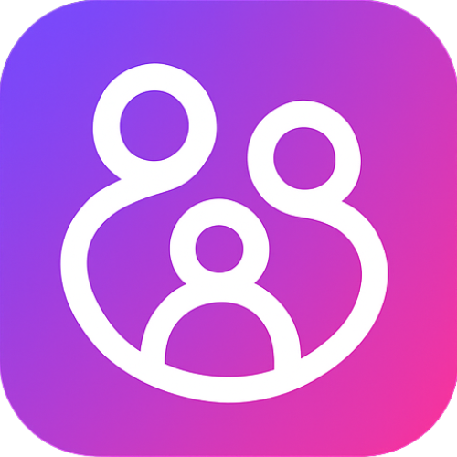

# Perekas - A Failed SaaS Journey

> **Note**: This project is now open-source as a case study of a SaaS that didn't find product-market fit. People signed up and created accounts, but weren't willing to pay for subscriptions. This is the complete codebase - use it to learn from my mistakes, explore the architecture, or fork it for your own project.



## What Was Perekas?

**Perekas** (Estonian for "family") was a family task management SaaS platform built with Django. The idea was simple: help families coordinate tasks, manage rewards for children, and stay organized through a gamified task and reward system.

### The Vision
- **Task Management**: Parents could assign tasks to children with priorities, due dates, and point rewards
- **Rewards System**: Children earned points by completing tasks and could claim rewards
- **Shopping Lists**: Shared family shopping lists (premium feature)
- **Subscription Tiers**: FREE, STARTER, and PRO tiers with Stripe integration

### What Actually Happened
The application was built, deployed, and people did sign up. Families created accounts, added members, and started using the platform. However, when it came time to subscribe and pay - crickets. The conversion rate from free users to paid subscribers was essentially zero.

## Screenshots of What Was Built


*The main dashboard showing family overview and task statistics*


*Task management interface with priorities, due dates, and assignment*


*Detailed task view with recurrence options and point values*


*Rewards management where points can be claimed*


*Individual reward details with point costs*


*Shared shopping list feature (premium)*


*Stripe-integrated subscription management*


*User account settings and preferences*


*Email notification preferences*

## Why It Didn't Work (Post-Mortem Reflection)

While I can't know for certain why people didn't subscribe, here are some likely reasons:

### 1. **Value Proposition Issues**
- The free tier was too generous (30 tasks/month, 4 rewards/month)
- Premium features (shopping lists, more tasks) weren't compelling enough
- Families could likely use free alternatives (Google Keep, Trello, physical charts)

### 2. **Market Fit**
- The Estonian market is small, which limits potential customer base
- Parents may have preferred physical reward charts or simple apps
- The problem might not have been painful enough to warrant a paid solution

### 3. **User Experience**
- The interface was functional but may not have been polished enough
- Mobile experience could have been better (desktop-first design)
- Onboarding might have been too complex for busy parents

### 4. **Pricing Psychology**
- The jump from free to paid might have felt too steep
- No trial period for premium features
- Shopping lists as a premium feature wasn't a strong differentiator

### What I Learned
- **Building the product is only 10% of the battle** - marketing, sales, and product-market fit are everything
- **Talk to customers before building** - I should have validated willingness to pay before building
- **Free tier strategy matters** - Make it useful but not so useful that paid isn't needed
- **Small markets are hard** - Building for a small market (Estonia) limits growth potential

## What's Included

This is a complete, production-ready Django application with:

- ✅ Full authentication system (django-allauth)
- ✅ Family management with roles (parent/child)
- ✅ Task management with priorities, due dates, and recurrence
- ✅ Points and rewards system
- ✅ Shopping lists (premium feature)
- ✅ Stripe subscription integration
- ✅ Subscription tier limits and usage tracking
- ✅ Email notifications
- ✅ Dashboard with statistics
- ✅ Django admin integration
- ✅ Comprehensive tests
- ✅ Production-ready settings

## Technology Stack

- **Backend**: Django 5.2.8
- **Authentication**: django-allauth 65.13.0
- **Payments**: Stripe 13.2.0
- **Database**: SQLite (dev) / PostgreSQL (production)
- **Static Files**: WhiteNoise
- **Task Scheduling**: APScheduler
- **Python**: 3.12+ (tested with 3.14)

## Quick Start

### Prerequisites

- Python 3.12+ (3.14 tested)
- pip
- Virtual environment (recommended)

### Installation

1. **Clone the repository**:
   ```bash
   git clone <repository-url>
   cd Perekas-Django
   ```

2. **Create and activate virtual environment**:
   ```bash
   python -m venv venv
   source venv/bin/activate  # On Windows: venv\Scripts\activate
   ```

3. **Install dependencies**:
   ```bash
   pip install -r requirements.txt
   ```
   
   **Note**: If you're on Python 3.14 and `psycopg2-binary==2.9.9` fails, install the latest version:
   ```bash
   pip install psycopg2-binary --upgrade
   ```

4. **Set up environment variables**:
   Create a `.env` file in the project root (see `.env.example` for template):
   ```env
   SECRET_KEY=your-secret-key-here
   # For Stripe (optional for local dev):
   STRIPE_PUBLIC_KEY=pk_test_...
   STRIPE_SECRET_KEY=sk_test_...
   ```

5. **Run migrations**:
   ```bash
   python manage.py migrate
   ```

6. **Create superuser** (optional):
   ```bash
   python manage.py createsuperuser
   ```

7. **Run development server**:
   ```bash
   python manage.py runserver
   ```

8. **Access the application**:
   - Main site: http://127.0.0.1:8000/
   - Admin panel: http://127.0.0.1:8000/admin/
   - Dashboard: http://127.0.0.1:8000/dashboard/

## Project Structure

```
perekas-django/
├── _core/                    # Core Django settings and configuration
├── a_account/               # Account management
├── a_dashboard/             # Dashboard application
├── a_family/                # Family management (models, forms, utils)
├── a_landing/               # Landing page and marketing
├── a_rewards/               # Rewards system
├── a_shopping/              # Shopping list feature (premium)
├── a_subscription/          # Subscription and billing (Stripe)
├── a_tasks/                 # Task management with recurrence
├── docs/                    # Documentation
├── scripts/                 # Utility scripts
├── static/                  # Static files (CSS, JS, logos)
├── templates/               # HTML templates
├── README pics/             # Screenshots
└── requirements.txt         # Python dependencies
```

## Key Features

### Family Management
- Create families with owners and members (parents/children)
- Role-based access (parent/child)
- Family join codes for inviting members
- Points system for children

### Task Management
- Create, assign, and track tasks
- Priority levels (Low, Medium, High)
- Due dates with Estonian date format support
- Recurring tasks (daily, weekly, monthly, custom patterns)
- Task completion with approval workflow
- Points awarded upon completion

### Rewards System
- Create rewards with point costs
- Children claim rewards using earned points
- Monthly limits based on subscription tier

### Shopping Lists (Premium)
- Shared shopping lists for families
- Requires STARTER or PRO subscription
- Items can be added by any family member

### Subscription Management
- Three tiers: FREE, STARTER, PRO
- Stripe integration for payments
- Usage tracking (tasks/rewards per month)
- Subscription limits enforced throughout the app

## Subscription Tiers

| Feature | FREE | STARTER | PRO |
|---------|------|---------|-----|
| Parents | 1 | 2 | 2 |
| Children | 1 | 2 | 5 |
| Tasks/month | 30 | 45 | Unlimited (1000) |
| Rewards/month | 4 | 10 | 50 |
| Shopping Lists | ❌ | ✅ | ✅ |

## Environment Variables

Create a `.env` file in the project root. See `.env.example` for a complete template.

### Required for Development
```env
SECRET_KEY=your-secret-key-here

# Stripe Configuration (Test Keys - optional for local dev)
STRIPE_PUBLIC_KEY=pk_test_...
STRIPE_SECRET_KEY=sk_test_...
STRIPE_WEBHOOK_SECRET=whsec_...
STARTER_MONTHLY_PRICE_ID=price_...
STARTER_YEARLY_PRICE_ID=price_...
PRO_MONTHLY_PRICE_ID=price_...
PRO_YEARLY_PRICE_ID=price_...
```

### For Production
- Production Stripe keys (not test keys)
- Email SMTP configuration
- `DEBUG=False`
- `ALLOWED_HOSTS` (comma-separated domains)
- `DATABASE_URL` (PostgreSQL connection string)

## Development

### Running Tests
```bash
# Run all tests
python manage.py test --verbosity=2

# Run tests for specific app
python manage.py test a_tasks --verbosity=2

# Use convenience script
python scripts/run_tests.py
```

### Creating Migrations
```bash
python manage.py makemigrations
python manage.py migrate
```

### Static Files
```bash
python manage.py collectstatic
```

## Architecture Highlights

### Subscription Limits
Subscription limits are enforced in `a_subscription/utils.py`:
- `check_subscription_limit()` - Verify resource creation is allowed
- `increment_usage()` - Update monthly usage counters
- `can_add_member()` - Verify member addition limits

### Points System
- Users earn points by completing tasks
- Points stored in `UserProfile.points`
- Rewards can be claimed using points
- Points are family-scoped

### Recurring Tasks
The `a_tasks` app includes sophisticated recurrence logic:
- Daily, weekly, monthly patterns
- Business day options
- Custom recurrence rules
- Automatic task generation via APScheduler

## What You Can Do With This

1. **Learn from the architecture** - See how a Django SaaS is structured
2. **Explore Stripe integration** - Full subscription management implementation
3. **Study the codebase** - Well-organized, tested code
4. **Fork and modify** - Use as a starting point for your own project
5. **Learn from mistakes** - Understand what didn't work (see post-mortem above)

## Contributing

This is now an open-source project! Feel free to:
- Fork the repository
- Submit issues
- Create pull requests
- Use it as a learning resource

## License

Open source - see LICENSE file (or feel free to use as you wish)

## Final Thoughts

This project represents hundreds of hours of work - building, testing, deploying, and trying to find customers. While it didn't succeed as a business, I hope others can learn from it. Whether you're building your own SaaS, learning Django, or just curious about how subscription apps work - I hope this codebase is useful.

**The biggest lesson**: Before you build, make sure people are willing to pay for your solution. I built something people wanted to use, but not something they wanted to pay for. There's a difference.

Good luck with your own projects! 🚀

---

*If you found this useful or learned something, a star would be appreciated. If you have questions about the codebase or want to discuss SaaS failures, feel free to open an issue.*
